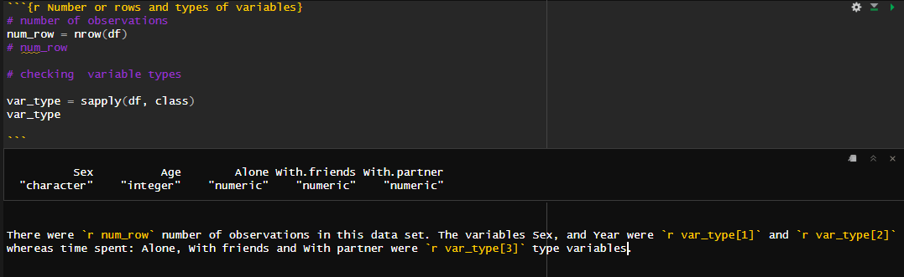

```{r load libraries, message = FALSE, include = FALSE}

library(dplyr)
library(tidyr)
library(knitr)
library(tidyverse)
library(ggplot2)
library(plotly)

library(viridis)
# colours were selected from the viridis pallete which is a colour blind friendly pallete
colors = c("#E16462FF", "#6A00A8FF", "#0D0887FF", "#B12A90FF", "#FCA636FF")

# Get rid of scientific notation
options(scipen = 999)

#return only 7 decimal places according to original dataset
options(digits = 7)

```


### Research Question
#### Do Americans who spent more time with a partner spend less time alone?
Did Americans who said they spent more time with partners also say that they spent less time alone, and were there any blatant differences between men and women?


```{r read csv}

csv = read.csv("Data/time-spent-with-relationships-by-age-us.csv")
# head(csv, n = 10)

df <- csv %>% select(-With.children, -With.family, -With.coworkers) %>%
  rename("Sex" = "Entity") %>%
  rename("Age" = "Year")
# head(df, n = 10)

```
 

### Data set introduction

Researchers surveyed Americans on who they spend time with in measured by hours per day. Survey responses were fell into the categories of alone, with friends, with family, with partner and with coworkers. The data set located by the file path "relationship_data/time-spent-with-relationships-by-age-us.csv" includes information on the respondents age, sex and the amount of time they spent per day for each category. The data set has been aggregated to show the average response of respondents at every age between 15 and 80 for men, women and the average of all.

The following table briefly outlines each variable in our data set.


```{r}

variables <- data.frame(
  Name = c("Sex",
           "Age",
           "Alone",
           "With friends",
           "With partner"),
  Description = c("Divided in categories: All people, Men and Women",
                  "Ages between ages 15 to 80",
                  "Time in hours per day reported alone",
                  "Time in hours per day reported with friends",
                  "Time in hours per day reported with partner"
                  )
)

kable(variables, col.names = c(
  "Name",
  "Description"),
  format = "pipe", padding = 15,
  caption = "Data set variables with a brief description"
  )

```

### Data set description

```{r Number or rows and types of variables}
# number of observations
num_row = nrow(df)
# num_row

# checking  variable types

var_type = sapply(df, class)
# var_type

```

There were `r num_row` number of observations in this data set. The variables Sex, and Year were `r var_type[1]` and `r var_type[2]` type variables respectively whereas time spent: Alone, With friends and With partner were `r var_type[3]` type variables.


```{r inclduing image}

```

<br>
Below shows a dataframe with the first two rows of the data set, as well as the variable names and types.

```{r string of rows}


string = str(head(df,2))

```

<br>
### Data summary

```{r}
Summaries <- df %>%
  group_by(Sex) %>%
  summarize(Mean_alone = mean(Alone),
            Mean_with.partner = mean(With.partner),
            Sum_alone = sum(Alone),
            Sum_with.patner = sum(With.partner))
  
```
```{r}
kable(Summaries, col.names = c(
  "Sex",
  "Mean alone",
  "Mean with partner",
  "Sum alone",
  "Sum with partner"),
  format = "pipe", padding = 15,
  caption = "Mean and sum of time spent with partner and time spent alone for men and women"
  )
```

The table showed that men on average reported more time with their partner and more time alone compared to women. This may indicate that women spend more time with either, friends, family or coworkers. **Both men and women spent on average almost double the amount of time by themselves rather than with a partner.**

<br>

### Visulisations

```{r Visualisation, fig.width=8, fig.height= 5, warning = FALSE, fig.align='center'}
visual_df <- subset(df, Sex != "All people")

Time_distro <- ggplot(visual_df, aes(x = Alone,
                      y= With.partner,
                      fill = Sex,
                      label = Age)) +
  geom_point(size = 3, alpha = 0.5, shape=21, color= "black")+
  labs(y = "Time spent with partner", x = "Time spent alone", fill = "Sex", title = "Time spent alone by time spent with partner") +
  scale_fill_manual(values = colors) +
  scale_size(range = c(1, 20), name = " ")+
  # adjusting the increments on both axes
  scale_x_continuous(breaks = seq(0, 9, by = 1)) +
  scale_y_continuous(breaks = seq(0, 9, by = 1)) +
  coord_cartesian(xlim = c(3, 9), ylim = c(0, 6)) +
  theme_light()

ggplotly(Time_distro, tooltip = c("Sex", "Age"))

```

- *Women on average did not tend to spend more than four hours with a partner regardless of how much or little time they spend alone.*
- *Men who reported spending the most time alone, also reported spending the most time with a partner, overlaying age data, we can see that it was men between ages 65 and 80 who were represented. Hover over each point on the graph to show gender and age information.*

# Further analysis

We wanted to understand groups who spend the most time alone, and then how they spend their time with other groups.

In the following table we grouped the data into age groups by 10 year increments.


```{r Additional table, message = FALSE, warning = FALSE}

# used gemini response of how to group by age
ten_year_df <- df %>%
  mutate(Age_group = case_when(
    Age <= 24 ~ "15-24",
    Age <= 34 ~ "25-34",
    Age <= 44 ~ "35-44",
    Age <= 54 ~ "45-54",
    Age <= 64 ~ "55-64",
    Age > 64 ~ "65-80",
  )) %>%
  group_by(Age_group, Sex) %>%
  summarise(
    Alone_mean = mean(Alone),
    With.partner_mean = mean(With.partner),
    With.friends_mean = mean(With.friends)
  )

ten_year_df <- subset(ten_year_df, Sex == "All people")
ten_year_df <- subset(ten_year_df, select = -Sex)

kable(ten_year_df, col.names = c(
  "Age group",
  "Alone mean",
  "With partner mean",
  "With friends meanr"),
  format = "pipe", padding = 15,
  caption = "Mean of time spent alone, with parnter and with friends by age group"
  )


```

We want to see as people spend more time alone how do they spend more time with a partner or with friends using line graphs.

```{r Additional graph, fig.width=8, fig.height= 5, warning = FALSE, fig.align='center'}

visual_df2 <- df %>%
  pivot_longer(
  cols = c("Alone", "With.partner", "With.friends"),
  names_to = "With_who",
  values_to =  "Time_spent"
  )

visual_df2 <- subset(visual_df2, Sex == "All people")
  


Line_graph <- ggplot(visual_df2, aes(
  x = Age,
  y = Time_spent,
  group = With_who,
  color = With_who)) +
  geom_line(linewidth = 1) +
  scale_x_continuous(breaks = seq(15, 80, by = 5)) +
  theme_light() +
  labs(y = "Time spent", x = "Age", color = "With who", title = "How time is spent by age") +
  scale_color_manual(values = colors)
  
Line_graph


```


### Conclusions

Do Americans who spent more time with a partner spend less time alone? The data indicated that time spent with a partner did not detract from time being alone. From the mean and summary table we could see that men on average spent more time by themselves and with a partner compared to women. Further analysis of the other variables may show that women on average spend more time with friends, coworkers or family compared to men.

We further explored the relationship of how much time people spend alone compared to how much time they spend with their partner, by creating a scatterplot. The scatterplot showed that there was no inverse relationship and that time spent with a partner remained consistent for women even as they spent more time alone. Seeing at which ages behaviours occurred, we saw that women begin to spend increasingly more time with their partners throughout their late teens to mid twenties, and then continue to spend a similar amount of time with their partners.

### References
https://ourworldindata.org/grapher/time-spent-with-relationships-by-age-us
